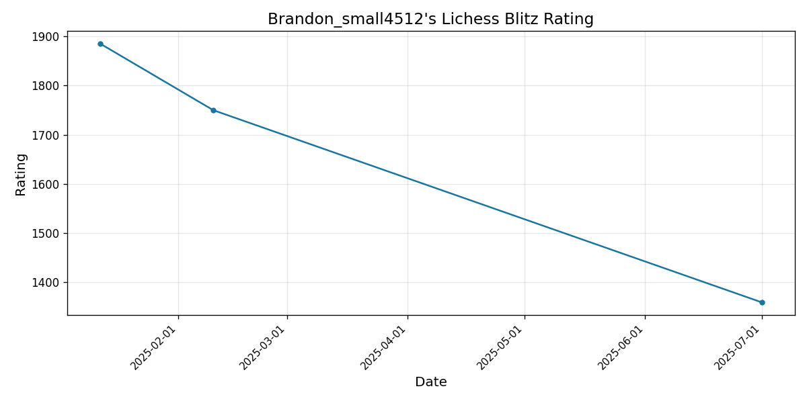

### Hi there 👋 👨‍💻


[](https://t.me/Brandon_small)
[](mailto:muska.fon@gmail.com)
[](https://vk.com/ckittidar)


<p>
I’m Stepan Nesmeyanov, a student at BMSTU and an enthusiastic developer who loves solving complex problems and mastering new technologies. 🚀
<br/>
 - 💻 Tech stack: JavaScript, C++/C, JavaScript/HTML/CSS, Go, SQL, Python, Linux.
<br/>
 - 📚 Currently improving: algorithms, data structures, and database management.
<br/>  
 - 🔍 Interested in: backend development, high-load systems, and databases.
<br/>
 - 🎯 Looking for a job in an IT company where I can grow and solve interesting problems.
</p>


  
  
### ✨  A little about me

- ⚡ I love programming for the ability to create something useful.
- 🔍 I strive to write clean, efficient code and develop reliable systems.
- 🎿 In my free time, I write pet projects, learn new technologies, write poetry, play the guitar, and chess.
<!--- ⚡️ Fun-Fact: I sleep at 6am 🙃. -->
- 📫 How to reach me: muska.fon@gmail.com
- 📝 [Resume](https://disk.yandex.ru/d/llXkWyEEtvBUxw)

### 🛠 Languages and Tools:


  
  [](https://github-readme-stats.vercel.app/api?username=BrandonSmall4512&show_icons=true&theme=radical)

  

  
  ##### I am currently aiming to reach ELO 1700 blitz on LiChess ⚡. Here is an ascii tracker of my 100 previous LiShess blitz games.



  ```
  # ♟︎ Ratings Chart #


